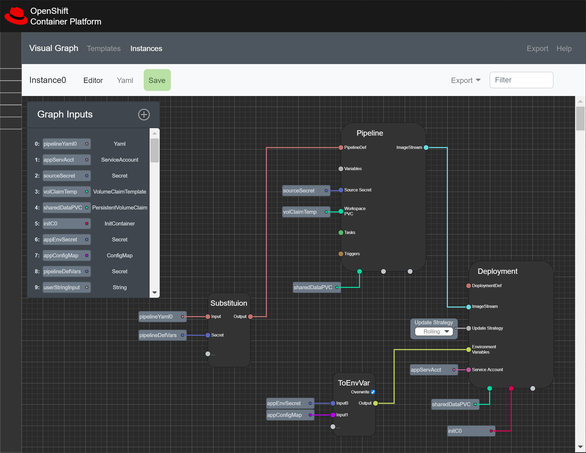

# Visual Graph for Kubernetes (VGK)
Visual Graph for Kubernetes (VGK) is a `low-code` Visual Graphing system to create and script Objects on Kubernetes. VGK is comprised of `VisualGraphs` and `VisualSubGraphs` objects.

###### Figure 1.) Mock Design

---
## Visual Graphs

`VisualGraphs` are defined by `GraphInputs` and `GraphNodes` which are used together to orechestrate a visual user experience around creating and maintaining Objects on Kubernetes. Supporting a wide vareity of use cases, `Visual Graphs` are typically used to construct entire Application Deployments, CI/CD Pipelines, Secret/ConfigMap Injection but can also be used for nearly limitless possibilities - Any Defined Object in the Kuberetes API can be leveraged in this `low-code` Visual Scripting Tool.

`GraphInputs` are user-created _variables_ that can represent any Object Reference on the cluster -or- YAML primitive (like strings, booleans, ints, etc.). `GraphInputs` ared used in conjunction with `GraphNodes` to act as `Inputs` to complete the Object Defintions.

---
## GraphNodes

`GraphNodes` are the primary building block for `VisualGraphs` and are generated for every well-defined Object Definition on the target cluster's Kuberentes API (CRDs & k8s-core Object Definitions). `GraphNodes` are logically equivalent to the _YAML_ Schema they represent.

Required and Optional Fields for the Schema are defined as `Inputs`, they are visually represented as _Connectors_ on the `GraphNodes` _Left-Side_ and support _Connections_ from `GraphInputs` and other `GraphNodes` `Outputs`.

`Outputs` are relatively standard across `GraphNodes` where there is typically only _1 Output_ defined as `stdout` - which in the case of `VisualGraphs`, the `stdout` is always the `GraphNodes` with its `Inputs` applied resulting in a _Complete YAML Object Definition_. Occasionally, _multiple_ `Outputs` are used which implies that the given `GraphNode` is typically linked together in sequence with other `GraphNodes` (Tekton Pipeline Tasks, etc.) where a specific order is required and preserved.

---
## Graph Utility Nodes
VGK also provides `GraphUtilityNodes` which are common Utilities and Helper Functions commonly used to make `VisualGraphs` more effective and create Shortcuts for doing longer/tedious cluster tasks.

`GraphUtilityNodes` Operations List:
Operation | - | Description
 --- | - | --------- 
 `ToEnvVar` | => | Output `N Inputs` as `1 Output` in common _Environment Variable_ form for _Deployments_
 `Substitute` | => | Perform Variable Substitution on `1 Input YAML` with `N Inputs` of substitution Values / Secrets / ConfigMaps and create `1 Output YAML` that is fully substituted with the `N Inputs`
 `Diff` | => | Perform a Diff between `N Inputs` of YAML and create `1 Output` of the resulting Diff YAML
 `Merge` | => | Perform a Merge between `N Inputs` of YAML and create `1 Output` of the resulting Merged YAML

---
## What is it?
- Operator (first and foremost)
- Visual Graph User Interface
    - Focus 1: OpenShift Console Dynamic Plugin
    - Focus 2: General k8s UI

## Original Abstract

My idea comes from a lot of tools I've been using recently (Game Engines like Unity and Unreal, Circuit Builders, etc.), they've all started implementing a very dynamic and useful Visual Graph System that uses dynamic Nodes to take inputs and outputs and drive configurations/process/etc.

My rendition is the OpenShift Visual Graph: Completely architect, manage, and scale entire application systems using a Visual Graph/Node system. The Visual Graph Node Toolbox contains every API Schema/Definition on OpenShift since they are generated from the active API where it's installed. 

Graph Nodes are dynamic and operate on Inputs & Outputs - Inputs are defined as any Object Reference on-platform or Primitive supported by YAML, Outputs are any resulting Data or Object Reference that is created as a result of the Graph Node operating on its Inputs. 

The Graph Node Toolbox also supports a number of Utility Core Nodes, These are Graph Nodes like Substitute, ToEnvVar, Aggregate, Combine, Diff, and more. Utility Core Nodes provide mechanisms to Manipulate Inputs & Outputs of other Nodes and Variables (typically String / YAML operations).

All of this combines to provide a fully dynamic and visual system to creating anything in OpenShift, providing a whole new experience for usability/visibility of Application Development & Delivery.

OpenShift Visual Graph Instances are a defined instance of a Graph. This definition, as seen in the editor below, leverages Utility Core Nodes to combine Secrets with Yaml Definitions as well as take many Inputs and output them as Environment Variables for another Object - The Pipeline Node will generate an OpenShift Pipeline & The Deployment Node will generate an OpenShift Deployment, all with the provided Inputs and manipulations. Making an V1 of a fully visual experience to building complex applications on OpenShift.